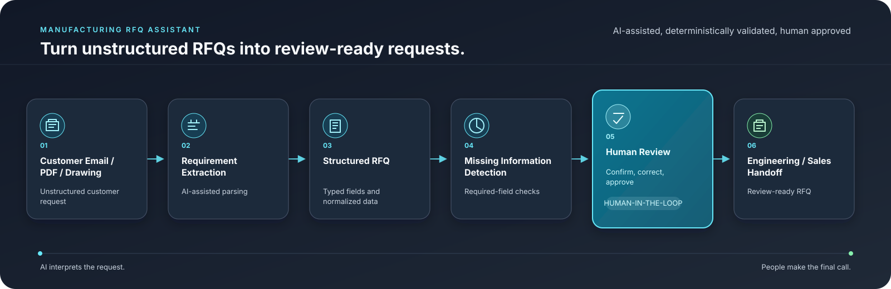
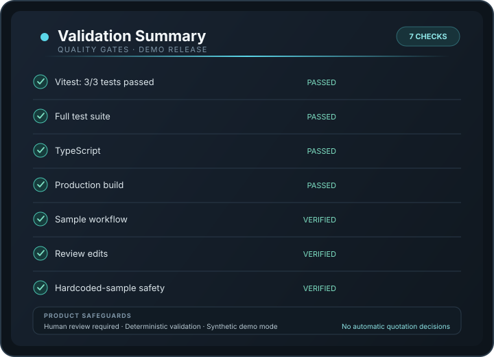

# Manufacturing RFQ Assistant

A portfolio demonstration of a human-in-the-loop workflow that turns unstructured manufacturing RFQs into structured, review-ready records before sales or engineering action.

<p align="center">
  
</p>

## What it demonstrates

- Customer email / pasted-text intake
- Structured extraction into a typed RFQ schema
- Deterministic required-field validation
- Field provenance and human corrections
- Clarification-draft generation
- Review-ready engineering / sales handoff
- JSON export

The system is deliberately human-in-the-loop: AI may interpret unstructured text, while deterministic software decides completeness and readiness. It does **not** calculate pricing, select suppliers, make engineering decisions, or send email automatically.

## Workflow

<p align="center">
  
</p>

The intended flow is:

`Intake → Extract → Validate → Review → Handoff`

The explanatory diagram separates structured RFQ creation and missing-information detection into distinct conceptual steps, while the application UI groups them into the five operational stages above.

## Demo mode

Click **Load sample RFQ** to run the complete workflow without an API key.

The built-in sample is a predefined, synthetic cable-assembly request for **ABC Industrial Ltd.** It preserves the customer details shown in the source request, including:

- Emily Chen
- emily.chen@example.com
- 2,000 cable assemblies
- Molex Micro-Fit 3.0 and JST PH connector families
- December 15, 2026 requested delivery
- No uploaded drawing or attachment

Demo mode never substitutes this sample for arbitrary customer text.

## Live AI mode

`POST /api/extract-rfq` supports optional live extraction through `OPENAI_API_KEY`.

If no provider is configured, arbitrary customer text is **not** processed and the API returns an explicit unavailable-AI message. No synthetic extraction is silently returned.

When enabled, the server:
- keeps the API key server-side
- asks the model to return only explicit customer-provided values
- uses `null` for missing fields
- validates the result against the local Zod schema
- rejects malformed model output

## Validation status

<p align="center">
  
</p>

Current verification:
- Vitest suite: **3/3 passing**
- TypeScript: **passes with `tsc --noEmit`**
- Production build: **passes**
- Demo source / extraction consistency: **verified**
- Human edit propagation to handoff: **verified**
- Arbitrary-text safety: **verified not to return the hardcoded sample**

These checks validate the current demonstration behavior. They are not a claim of production certification.

## Local setup

```bash
pnpm install
pnpm dev
```

Open `http://localhost:3000`.

Optional live extraction:

```bash
cp .env.example .env.local
# then set OPENAI_API_KEY in .env.local
```

## Useful commands

```bash
pnpm dev
pnpm test
pnpm typecheck
pnpm build
```

## Architecture

```text
Customer request
      ↓
AI extraction (optional)
      ↓
Typed RFQ schema
      ↓
Deterministic validation
      ↓
Human review
      ↓
Engineering / sales handoff
```

Key files:

- `lib/rfq-schema.ts` — typed Zod schema
- `lib/demo-data.ts` — synthetic sample data
- `lib/validate-rfq.ts` — deterministic completeness rules
- `app/api/extract-rfq/route.ts` — server-side extraction boundary
- `components/rfq-dashboard.tsx` — end-to-end review workflow
- `tests/rfq-consistency.test.ts` — demo consistency and handoff checks

## Scope and limitations

This repository is a portfolio demonstration, not a production-certified RFQ system.

Current limitations include:
- no authentication or user accounts
- no database or persistent review history
- no CRM / ERP integration
- no email delivery
- no automatic quotation or supplier selection
- no production-grade upload pipeline
- engineering geometry is not inspected
- file-upload UI is present as a future-facing control but is not active in this demo

A production version would require authenticated access, durable audit history, stronger upload handling, malware scanning, rate limiting, observability, retention controls, and deployment-specific security review.

## Future extensions

- PDF text extraction with page-level provenance
- Document redaction and malware scanning
- Configurable required fields by product family
- Approval history and role-based review
- ERP / CRM handoff adapters
- Provider-managed structured outputs
- Supplier and pricing workflows behind explicit human approval gates

---

**Portfolio demonstration — synthetic data only. Human review is required before engineering or commercial action.**
